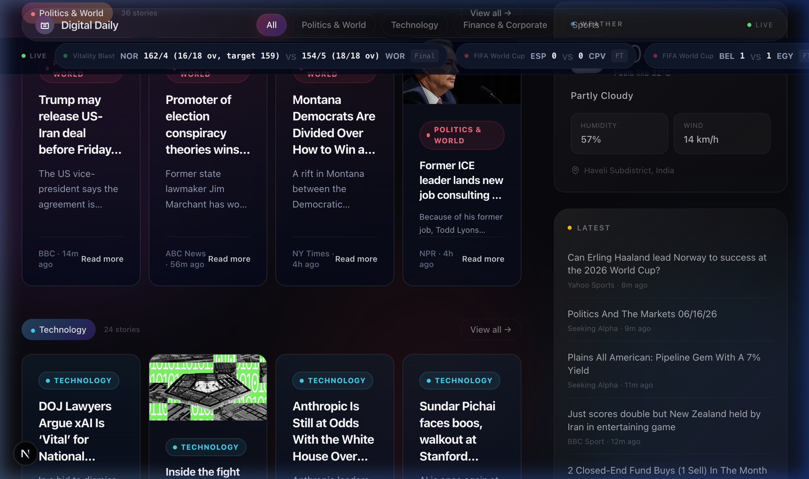
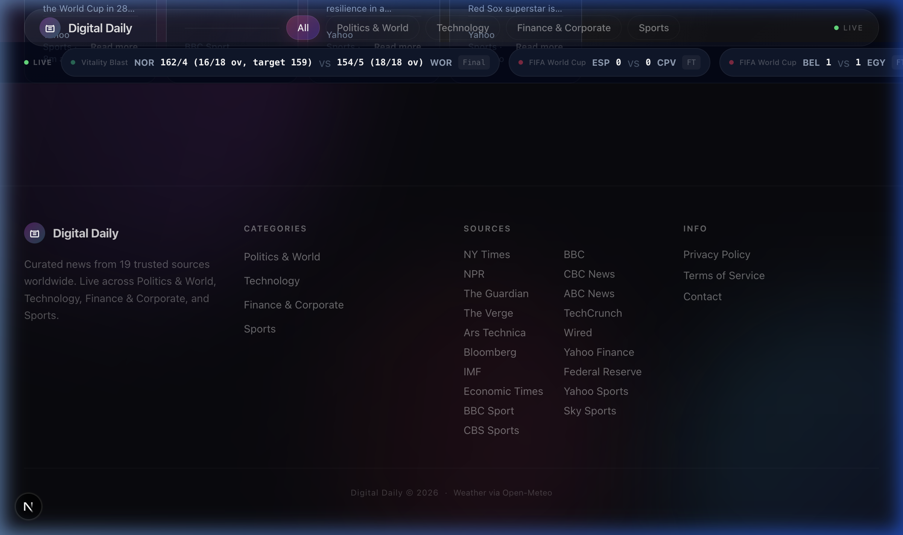

# Digital Daily

A premium, real-time news aggregator built with Next.js — curating headlines from 19+ trusted global sources across Politics & World, Technology, Finance & Corporate, and Sports.


## ✨ Features

### 📰 Real-Time News Aggregation
- Curates stories from **19 RSS feeds** including NY Times, BBC, Reuters, TechCrunch, Bloomberg, ESPN, and more
- Automatic categorization into **Politics & World**, **Technology**, **Finance & Corporate**, and **Sports**
- **Breaking news ticker** with rotating headlines
- **Trending Now** sidebar with the 5 most recent stories

### 🏆 Live Sports Ticker
- Real-time scores from the **ESPN API** across multiple sports:
  - 🏏 **Cricket** — World Cup, IPL, Big Bash, Champions Trophy, T20 Blast
  - ⚽ **Football** — FIFA World Cup, Premier League, La Liga, Bundesliga, MLS, UCL
  - 🏀 **NBA** — Live games and recent results
  - 🏎️ **F1** — Race results and live sessions
- Live matches show **pulsing indicators**; completed matches are **dimmed**
- Auto-refreshes every 60 seconds

### 🌤️ Weather Widget
- Requests geolocation permission on first visit
- Reverse geocodes location to city name via **OpenStreetMap Nominatim**
- Fetches current weather from **Open-Meteo API** (no API key needed)
- Graceful fallback with browser settings instructions if permission is denied
- One-click re-prompt to request location permission again

### 🔒 Security
- **Content Security Policy (CSP)** headers in production
- **HSTS**, **X-Frame-Options: DENY**, **X-Content-Type-Options: nosniff**
- **Permissions-Policy** restricting camera/microphone access
- **Strict Referrer-Policy** for cross-origin requests
- CSP intelligently skipped in development to support Turbopack HMR

### 🎨 Design
- Dark glassmorphism UI with frosted-glass cards
- Smooth animations powered by **Framer Motion**
- Category-specific color theming (emerald for Politics, cyan for Tech, amber for Finance, rose for Sports)
- Fully responsive layout — mobile, tablet, and desktop
- Custom SVG favicon



## 🛠️ Tech Stack

| Layer | Technology |
|-------|-----------|
| **Framework** | [Next.js 16](https://nextjs.org) (App Router, Turbopack) |
| **Language** | TypeScript |
| **UI** | React 19, Framer Motion |
| **Styling** | Tailwind CSS 4 |
| **News Data** | RSS feeds via `rss-parser` |
| **Sports Data** | ESPN Scoreboard API (free, no key required) |
| **Weather** | Open-Meteo API + OpenStreetMap Nominatim |
| **Icons** | Lucide React |

## 📁 Project Structure

```
src/
├── app/
│   ├── api/
│   │   ├── news/route.ts            # RSS feed aggregation
│   │   ├── weather/route.ts         # Weather proxy
│   │   └── sports/
│   │       ├── cricket/route.ts     # ESPN cricket (6 leagues)
│   │       ├── football/route.ts    # ESPN soccer (6 leagues)
│   │       ├── nba/route.ts         # ESPN NBA
│   │       └── f1/route.ts          # ESPN F1
│   ├── contact/page.tsx
│   ├── privacy/page.tsx
│   ├── terms/page.tsx
│   ├── layout.tsx                   # Root layout + metadata
│   ├── page.tsx                     # Homepage
│   └── globals.css                  # Design system tokens
├── components/
│   ├── navbar.tsx                   # Sticky navigation with category pills
│   ├── live-sports-ticker.tsx       # Scrollable live scores bar
│   ├── hero-section.tsx             # Featured + trending articles
│   ├── news-card.tsx                # Article card component
│   ├── category-section.tsx         # Grouped news by category
│   ├── sidebar.tsx                  # Weather + latest news sidebar
│   ├── weather-widget.tsx           # Geolocation weather card
│   └── footer.tsx                   # Site footer with links
└── lib/
    ├── feeds.ts                     # RSS feed source definitions
    ├── types.ts                     # TypeScript interfaces
    ├── themes.ts                    # Category color themes
    └── utils.ts                     # Utility functions
```

## 🚀 Getting Started

### Prerequisites
- Node.js 18+
- npm 9+

### Installation

```bash
# Clone the repository
git clone https://github.com/shrikalase88/digital-daily.git
cd digital-daily

# Install dependencies
npm install

# Start the development server
npm run dev
```

Open [http://localhost:3000](http://localhost:3000) in your browser.

### Production Build

```bash
npm run build
npm start
```

## 📡 News Sources

| Category | Sources |
|----------|---------|
| **Politics & World** | NY Times, BBC, Reuters, Al Jazeera, The Guardian, AP News, NPR |
| **Technology** | TechCrunch, The Verge, Ars Technica, Wired |
| **Finance & Corporate** | Bloomberg, CNBC, Financial Times, Seeking Alpha |
| **Sports** | ESPN, Yahoo Sports, BBC Sport |

## 📸 Screenshots



## 📄 License

This project is for personal/educational use. News content is sourced from publicly available RSS feeds.

---

<p align="center">
  Built with ❤️ using Next.js, React, and Tailwind CSS
</p>
