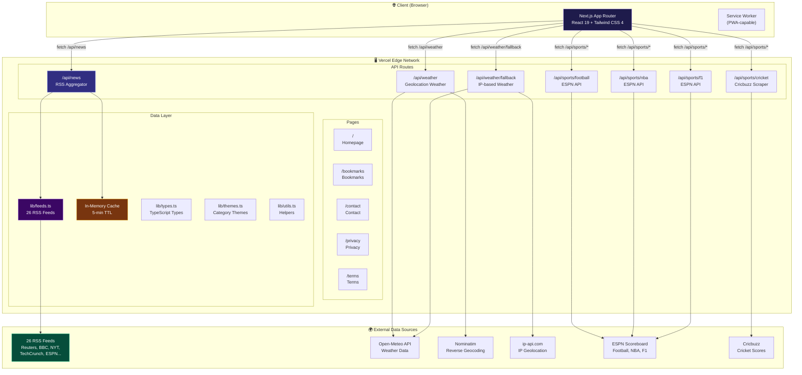
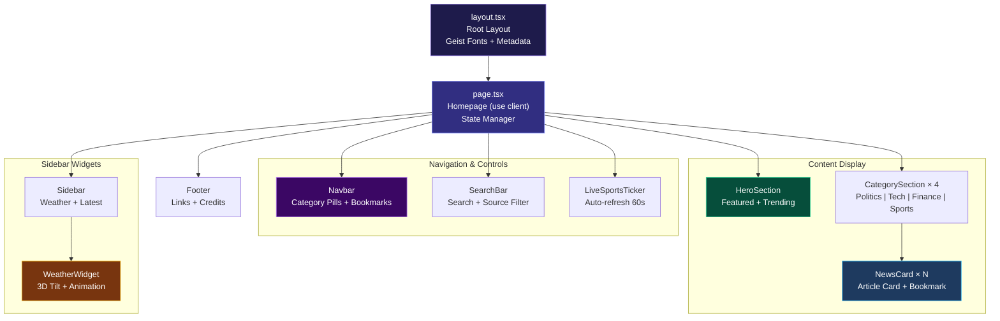
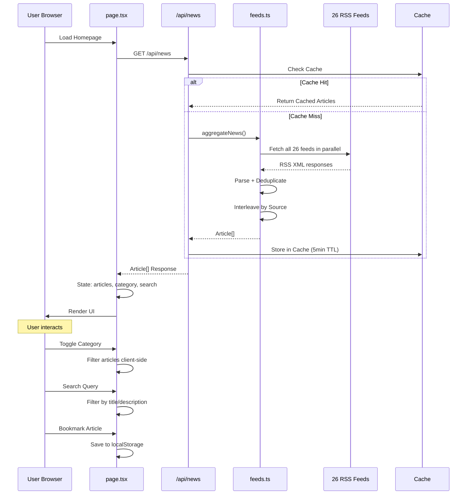
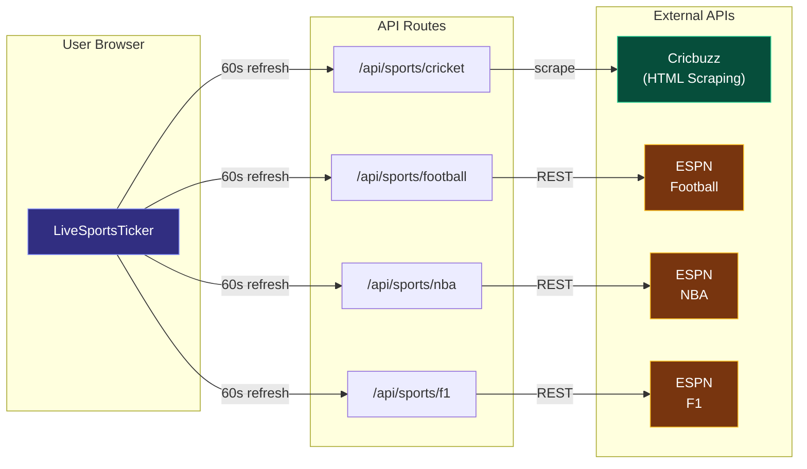
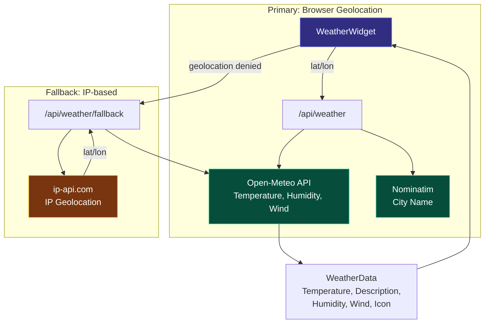
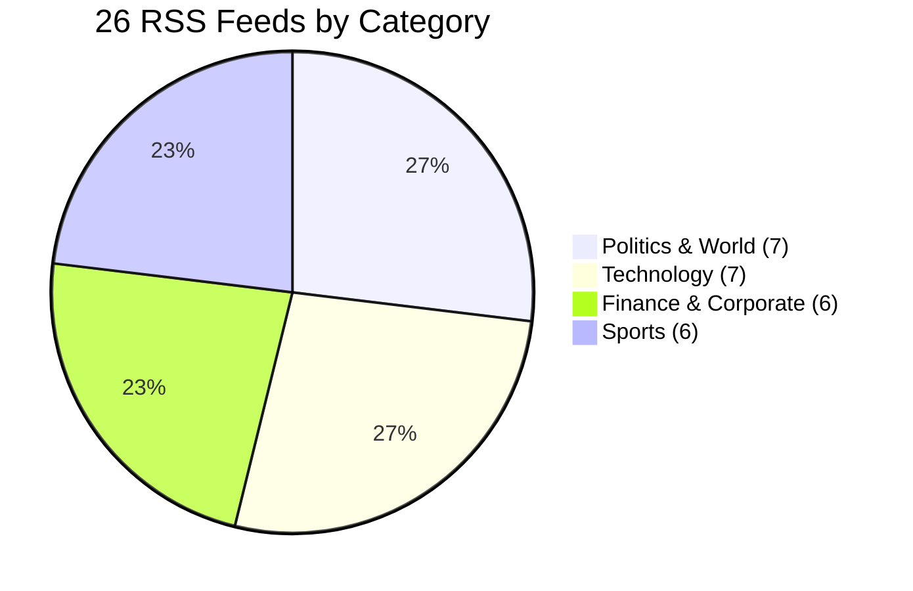
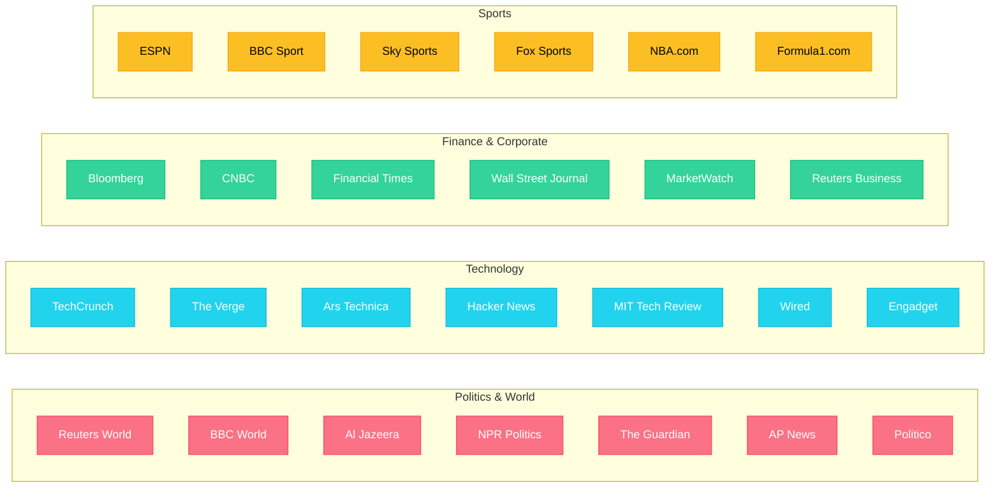
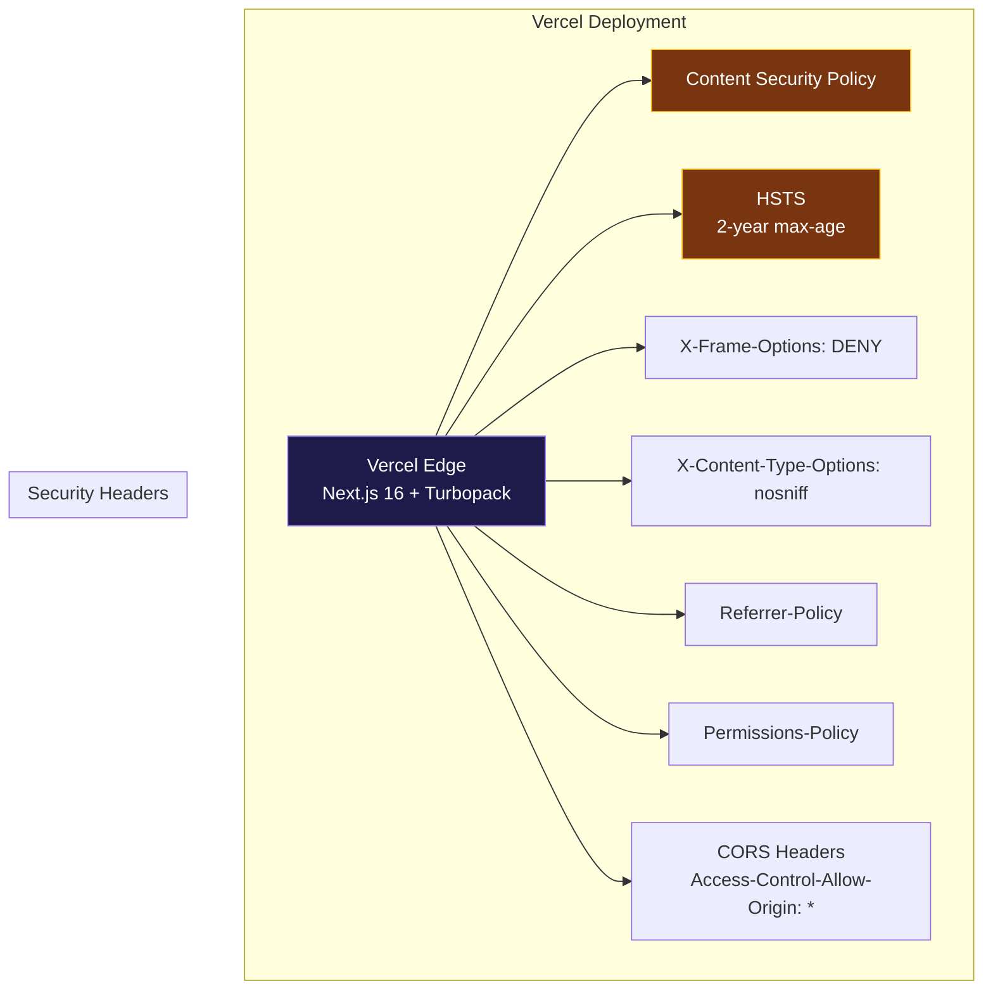

# Digital Daily - Architecture Graph

## System Overview

## Component Hierarchy

## Data Flow

## Sports Data Flow

## Weather Data Flow

## RSS Feed Distribution by Category

## Security & Deployment

